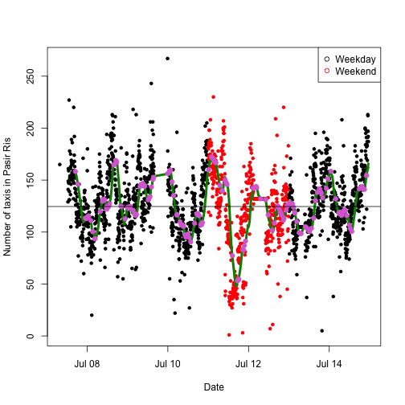

Visualize taxi distribution in Singapore over a week in July 2015
========================================================
author: Ying JIANG
date: Mon Dec 21 23:29:51 2015

Background: Tracking taxis in Singapore
========================================================

Singapore's taxis are tracked by the government agency Land Transport Authority. The agency [provides](http://www.mytransport.sg/content/mytransport/home/dataMall.html#Traffic_Related) data on realtime locations of free-for-hire taxis. For this project,

- Geographical coordinates of taxis were downloaded at every 5 minutes over a week in July 2015 (7th - 15th).
- The [names](https://en.wikipedia.org/wiki/Urban_planning_areas_in_Singapore) and [coordinates](http://data.gov.sg/Metadata/OneMapMetadata.aspx?id=Planning_Area_Census2010&mid=163212&t=SPATIAL) of Singapore's 55 Urban Planning Areas were downloaded. [Here's](https://www.ura.gov.sg/uol/master-plan/Contacts/View-Planning-Boundaries.aspx) to visualize the Areas at a glance.
- Eventually, we get the numbers of free-for-hire taxis in each Area for 7 days.

The app
========================================================

This app helps the interested user visualize the taxi availability across Singapore from 7th - 15th July 2015. The user enters the area code for the neighborhood of interest, and sees the area highlighted on a map, with a grey circle indicating the number of taxis at peak hours.

<!--html_preserve-->

<!--/html_preserve-->

Fluctuations in free-for-hire taxis
========================================================

The user could further enter plot parameters to visualize the peaks and valleys in the cyclical free-for-hire taxi data. Weekend's data is differentiated from weekday's by color. The raw data is superimposed with a smoothened trace, highlighted with peak and valley positions.

 

Impact and future work
========================================================

This study offered preliminary insights into taxi distribution in Singapore, with assignment of taxi locations into Singapore's urban planning areas - a platform for further analysis.

More meaningful data would come from observing the cycles through more number of days, so that we could predict the taxi availability in various neighborhoods (e.g. the central financial district versus a remote residential area). If individual taxis' could be tracked, we could also predict the flow and traffic patterns for more efficient urban transport design.

